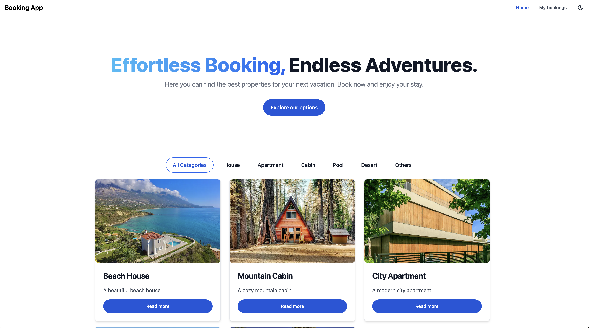
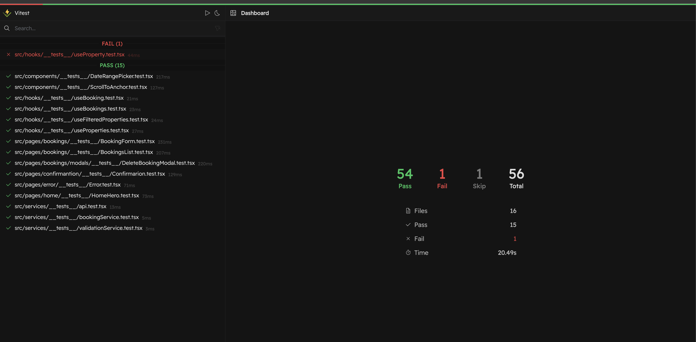

# Booking App

This is a booking application built with React, TypeScript, Vite and Bun. you can access the app [here](https://ecomachio.github.io/bookingapp/).

#### Here is how the app looks like:



## Table of Contents

- [Features](#features)
- [Prerequisites](#prerequisites)
- [Installation](#installation)
- [Project Structure](#project-structure)
- [Usage](#usage)
- [Architecture](#architecture)
- [Tests](#tests)
- [Deployment](#deployment)
- [Improvements](#improvements)

## Features

- Here you can see several properties.
- You can add, edit, and delete bookings.
- You can filter bookings by category.
- You see all your bookings in a list.
- you can change the appearance of the app by switching between light and dark mode.
- Mobile responsive design.

## Prerequisites

- [Bun](https://bun.sh/)

Install Bun with the following command: (you can also install it from the [official website](https://bun.sh/)

```sh
curl -fsSL https://bun.sh/install | bash
```

if you are using windows, please check the [official website](https://bun.sh/)

## Installation

First, clone the repository:

```sh
git clone https://github.com/ecomachio/bookingapp.git
```

Then, navigate to the project directory:

```sh
cd bookingapp
```

Install the dependencies:

```sh
bun install
```

Run the development server:

```sh
bun dev
```

You can now view the app in your browser at [http://localhost:5173](http://localhost:5173).

## Project Structure

- `src/`: source code for the application.
  - `assets/`: images and other static assets.
  - `components/`: React components shared across the application.
  - `context/`: React context providers.
  - `hooks/`: custom hooks.
  - `icons/`: SVG icons.
  - `pages/`: pages of the application.
  - `services/`: services for fetching data and domain logic. (see [improvents](#improvents))
  - `utils/`: Contains utility functions.
  - `types.ts`: types used across the application.
  - `constants.ts`: constants used across the application.

## Usage

To use the Booking App, follow these steps:

1. Access the app [here](https://ecomachio.github.io/bookingapp/).
2. Select a property from the list.
3. Select a check-in and check-out date.
4. Request a booking.
5. Confirm the booking.
6. You can view all your bookings in the list.

## Architecture

The app is built with a component-based architecture. Each component is responsible for a specific part of the UI. The components are reusable The components are styled with [Tailwind CSS](https://tailwindcss.com/) and [flowbite](https://flowbite.com/)

The app uses a global state management system with [React Context](https://reactjs.org/docs/context.html). it loads a list of properties from a local json file.
all state is in memory and not persisted.

The routes are managed with [React Router v6](https://reactrouter.com/).
Route structure:

- `/`: Home page.
- `/property/:id`: Property page. It is used to start the booking process.
- `/bookings`: Bookings List page.
  - `/:propertyId/confirmation/:bookingId/",`: Booking confirmation page.
  - `add/:propertyId`: Confirm booking page.
  - `:bookingId/:propertyId`: Edit booking page.
- `/404`: Error page.
- `*`: Error page. (fallback route)

`hooks` are mostly used for extract logic from components.

`services` are meant to be used as a layer between the components and the data source. in this case, the data source is a local json file. the services are not used in this app. they are meant to be used in a real-world application where data is fetched from an API.
Currently, the services are just returning the data from the local json file.

⚠️ `services` are also holding domain business logic. this should be moved to a domain folder in a real-world application where all the business logic is decouple from UI logic.

## Tests

The app has been tested with [vitest](https://vitest.dev/) and [react-testing-library](https://testing-library.com/docs/react-testing-library/intro/). To run
the tests, use the following command:

```sh
bun test:ui
```

## Deployment

The app is deployed GitHub Pages. it its deployed automatically when a new commit is pushed to the main branch.
⚠️ Github pages is not adequate for a single page application. it doesn't support client-side routing. (see [improvents](#improvents))

You should see the following output: it has one flake test. (see [improvents](#improvents))



## Improvements

- [ ] only allow future dates to be selected.
- [ ] add JSDocs to all functions.
- [ ] prevent not available dates from being selected.
- [ ] use local storage to persist bookings and appearance mode.
- [ ] add a loading state to the application. Currently loads just a simple loading text.
- [ ] Improve component library to make the typography and spacing more consistent.
- [ ] add more tests to all components.
- [ ] fix one flake test. this particular test is flakey because it only fails when the test is run with all the tests. when run alone, it passes. I didn't have time to fix it.
- [ ] deploy to a platform that supports client-side routing. (Vercel, Netlify, etc.)

## Contact

LinkedIn: [Edian Comachio](https://www.linkedin.com/in/edian-comachio)
